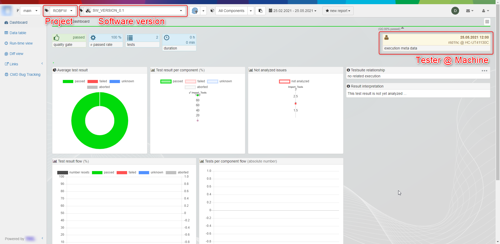

# RobotLog2DB

## Table of Contents

-   [Getting Started](#getting-started)
    -   [How to install](#how-to-install)
-   [Usage](#usage)
-   [Example](#example)
-   [Contribution](#contribution)
-   [Sourcecode Documentation](#documentation)
-   [Feedback](#feedback)
-   [About](#about)
    -   [Maintainers](#maintainers)
    -   [Contributors](#contributors)
    -   [License](#license)

## Getting Started

[RobotLog2DB](https://github.com/test-fullautomation/robotframework-robotlog2db)
is the tool that helps to import Robot Framework results (**\*.xml**
format) to
[TestResultWebApp](https://github.com/test-fullautomation/TestResultWebApp)
Dashboard.

[RobotLog2DB](https://github.com/test-fullautomation/robotframework-robotlog2db)
tool is operating system independent and only works with Python 3.

### How to install

RobotLog2DB is not available on [PyPI](https://pypi.org/) now.

But you can install this package directly from Github repository as
below:

    pip install git+https://github.com/test-fullautomation/robotframework-robotlog2db.git

Or you can clone sourcecode to your local directory then install this
package with below steps:

    git clone https://github.com/test-fullautomation/robotframework-robotlog2db.git
    cd robotframework-robotlog2db
    python setup.py install

After succesful installation, the executable file **RobotLog2DB** will
be available (under *Scripts* folder of Python on Windows and
*\~/.local/bin/* folder on Linux).

In case above location is added to **PATH** environment variable then
you can run it directly as operation system\'s command.

## Usage

[RobotLog2DB](https://github.com/test-fullautomation/robotframework-robotlog2db)
requires the Robot Framework result file(s) which contains the output
result in XML format (default name is `output.xml`) and
[TestResultWebApp](https://github.com/test-fullautomation/TestResultWebApp)\'s
database information for importing.

Use below command to get tools\'s usage

    RobotLog2DB -h

The usage should be showed as below:

    usage: RobotLog2DB (RobotXMLResult to TestResultWebApp importer) [-h] [-v] [-recursive] [-dryrun] [-append] [-UUID UUID] [--variant VARIANT] [--versions VERSIONS] [--config CONFIG]
                                                                         resultxmlfile server user password database

    RobotLog2DB imports XML result files (default: output.xml) generated by the Robot Framework into a WebApp database.

    positional arguments:
    resultxmlfile        absolute or relative path to the result file or directory of result files to be imported.
    server               server which hosts the database (IP or URL).
    user                 user for database login.
    password             password for database login.
    database             database schema for database login.

    optional arguments:
    -h, --help           show this help message and exit
    -v                   Version of the RobotLog2DB importer.
    -recursive           if set, then the path is searched recursively for output files to be imported.
    -dryrun              if set, then just show what would be done.
    -append              is used in combination with -UUID <UUID>. If set, allow to append new result(s) to existing execution result UUID in -UUID argument.
    -UUID UUID           UUID used to identify the import and version ID on webapp. If not provided RobotLog2DB will generate an UUID for the whole import.
    --variant VARIANT    variant name to be set for this import.
    --versions VERSIONS  metadata: Versions (Software;Hardware;Test) to be set for this import (semicolon separated).
    --config CONFIG      configuration json file for component mapping information.

The below command is simple usage with all required arguments to import
robot results into TestResultWebApp\'s database:

    RobotLog2DB <resultxmlfile> <server> <user> <password> <database>

Besides the executable file, you can also run tool as a Python module

    python -m RobotLog2DB <resultxmlfile> <server> <user> <password> <database>

## Example

In order the import the robot result(s) to TestResultWebApp\'s database,
we need the Robot Framework result file (`output.xml`).

So, firstly execute the robot testcase(s) to get the Robot Framework
result file.

Sample robot testcase which contains neccessary information for
importing into TestResultWebApp\'s database:

    *** Settings ***
    # Test execution level
    Metadata   project        ROBFW              # Project/Variant
    Metadata   version_sw     SW_VERSION_0.1     # Software version
    Metadata   version_hw     HW_VERSION_0.1     # Hardware version
    Metadata   version_test   TEST_VERSION_0.1   # Test version

    # File/Suite level
    Documentation             This is description for robot test file
    Metadata    author        Tran Duy Ngoan (RBVH/ECM1)
    Metadata    component     Import_Tools
    Metadata    testtool      Robot Framework 3.2rc2 (Python 3.9.0 on win32)
    Metadata    machine       %{COMPUTERNAME}
    Metadata    tester        %{USER}

    *** Test Cases ***
    Testcase 01
       [Tags]   ISSUE-001   TCID-1001   FID-112   FID-111
       Log       This is Testcase 01

    Testcase 02
       [Tags]   ISSUE-RTC-003   TCID-1002   FID-113
       Log       This is Testcase 01

### Notes:

> In case you are using RobotFramework AIO, these below `Metadata`
> definitions will be handled implicitly by [RobotFramework Testsuites
> Management](https://github.com/test-fullautomation/robotframework-testsuitesmanagement)
> library within Suite Setup.
>
> -   project
> -   version_sw
> -   version_hw
> -   version_test
> -   machine
> -   tester
> -   testtool
>
> So that you do not need to define them in your Robot testcase(s).
>
> However, if these `Metadata` definitions are already missing in the
> RobotFramework output result file, you can specific them when
> executing the RobotLog2DB tool with the optional arguments:
>
> -   `--variant VARIANT`: Project definitions
> -   `--versions VERSIONS`: Versions (Software;Hardware;Test)
>     definitions.
> -   `--config CONFIG`: Project, versions or component mapping
>     definitions.
>
> Please refer to [RobotLog2DB tool's
> Documentation](https://github.com/test-fullautomation/robotframework-robotlog2db/blob/develop/RobotLog2DB/RobotLog2DB.pdf)
> for more detail about these optional arguments.

After getting Robot Framwork result file (`output.xml`), use below
sample command to import that result into TestResultWebApp\'s database
which is hosted at *localhost* as below sample command

    RobotLog2DB output.xml localhost test_user test_pw test_db

Then, open TestResultWebApp with your favourite browser and you will see
how wonderful the execution result is displayed as below figures:

Dashboard view:

Datatable view:

## Contribution

We are always searching support and you are cordially invited to help to
improve
[RobotLog2DB](https://github.com/test-fullautomation/robotframework-robotlog2db)
tool.

## Sourcecode Documentation

To understand more detail about the tool\'s features, parameters and how
Robot testcase information will be displayed on TestResultWebApp, please
refer to [RobotLog2DB tool's
Documentation](https://github.com/test-fullautomation/robotframework-robotlog2db/blob/develop/RobotLog2DB/RobotLog2DB.pdf).

## Feedback

Please feel free to give any feedback to us via

Email to: [Robot Framework Support
Group](mailto:RobotFrameworkSupportGroup@bcn.bosch.com)

Issue tracking: [RobotLog2DB
Issues](https://github.com/test-fullautomation/robotframework-robotlog2db/issues)

## About

### Maintainers

[Thomas Pollerspöck](mailto:Thomas.Pollerspoeck@de.bosch.com)

[Tran Duy Ngoan](mailto:Ngoan.TranDuy@vn.bosch.com)

### Contributors

[Nguyen Huynh Tri Cuong](mailto:Cuong.NguyenHuynhTri@vn.bosch.com)

[Mai Dinh Nam Son](mailto:Son.MaiDinhNam@vn.bosch.com)

[Tran Hoang Nguyen](mailto:Nguyen.TranHoang@vn.bosch.com)

[Holger Queckenstedt](mailto:Holger.Queckenstedt@de.bosch.com)

### License

Copyright 2020-2022 Robert Bosch GmbH

Licensed under the Apache License, Version 2.0 (the \"License\"); you
may not use this file except in compliance with the License. You may
obtain a copy of the License at

> 

Unless required by applicable law or agreed to in writing, software
distributed under the License is distributed on an \"AS IS\" BASIS,
WITHOUT WARRANTIES OR CONDITIONS OF ANY KIND, either express or implied.
See the License for the specific language governing permissions and
limitations under the License.
